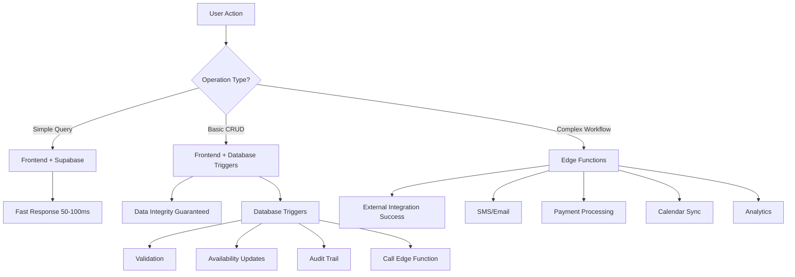

# 🏗️ Architecture Overview

## System Architecture

Our appointment app uses a **hybrid architecture** that combines the strengths of three different approaches:



## 🔄 Data Flow

### 1. Simple Query Flow
```
User Request → Frontend → Supabase Query → RLS Check → Result → UI Update
Time: ~50ms
```

### 2. Appointment Booking Flow
```
User Books → Frontend Insert → Database Triggers Fire → Edge Function Called
                ↓                      ↓                      ↓
           Appointment Created → Data Validated → SMS/Email Sent
           Time: ~100ms         Time: Instant    Time: ~400ms
```

### 3. Complex Operation Flow
```
User Action → Edge Function → Multiple Operations → Database Update → Response
                ↓                    ↓                    ↓
        External APIs        Business Logic      Data Consistency
        Time: ~400-2000ms    Time: Variable      Time: Instant
```

## 🎯 Core Components

### Frontend (React Native)
**Purpose:** User interface and simple data operations
- **Strengths:** Fast, real-time, great UX
- **Weaknesses:** Limited by device capabilities
- **Use for:** Queries, basic CRUD, UI interactions

### Database Triggers (PostgreSQL)
**Purpose:** Data integrity and automatic operations
- **Strengths:** Guaranteed execution, atomic, fast
- **Weaknesses:** Limited external integration
- **Use for:** Validation, data consistency, audit

### Edge Functions (Supabase/Deno)
**Purpose:** Complex business logic and external integrations
- **Strengths:** Full programming capability, external APIs
- **Weaknesses:** Network latency, complexity
- **Use for:** Notifications, payments, analytics

## 📊 Comparison Matrix

| Aspect | Frontend | Database Triggers | Edge Functions |
|--------|----------|-------------------|----------------|
| **Speed** | 🟢 Very Fast (50ms) | 🟢 Instant | 🟡 Medium (200-2000ms) |
| **Reliability** | 🟡 Depends on network | 🟢 Guaranteed | 🟡 Depends on external services |
| **External APIs** | 🔴 Limited | 🔴 None | 🟢 Full support |
| **Complex Logic** | 🟡 Limited | 🟡 Basic | 🟢 Unlimited |
| **Data Integrity** | 🟡 Can be bypassed | 🟢 Guaranteed | 🟡 Depends on implementation |
| **Real-time** | 🟢 Excellent | 🟢 Instant | 🔴 Not real-time |
| **Scalability** | 🟡 Device limited | 🟢 Database scales | 🟢 Auto-scaling |
| **Development** | 🟢 Easy | 🟡 SQL knowledge required | 🟡 Complex debugging |
| **Testing** | 🟢 Easy | 🔴 Difficult | 🟡 Moderate |

## 🔧 Technology Stack

### Frontend
- **React Native** - Mobile app framework
- **TypeScript** - Type safety
- **Supabase JS** - Database client
- **Redux Toolkit** - State management

### Backend
- **Supabase** - Backend as a Service
- **PostgreSQL** - Database with triggers
- **Deno** - Edge function runtime
- **Row Level Security** - Data access control

### External Services
- **Twilio** - SMS notifications
- **SendGrid** - Email service
- **Stripe** - Payment processing
- **Google Calendar** - Calendar integration

## 🎯 Design Principles

### 1. **Separation of Concerns**
- Frontend handles UI and simple queries
- Database handles data integrity
- Edge functions handle complex operations

### 2. **Fail-Safe Design**
- Critical operations use database triggers (can't fail)
- Non-critical operations use edge functions (can gracefully fail)
- Multiple fallback options for user actions

### 3. **Performance First**
- Keep fast operations in frontend
- Use triggers for instant data consistency
- Reserve edge functions for operations that need external services

### 4. **Security by Design**
- Row Level Security for data access
- JWT tokens for authentication
- Input validation at multiple layers

## 🚦 Decision Framework

```
Is it a simple query?
├─ YES → Frontend
└─ NO → Is data integrity critical?
    ├─ YES → Database Trigger
    └─ NO → Does it need external APIs?
        ├─ YES → Edge Function
        └─ NO → Frontend with fallback
```

## 📈 Benefits of This Architecture

### ✅ **Performance**
- Fast user interactions (frontend)
- Instant data validation (triggers)
- Efficient external operations (edge functions)

### ✅ **Reliability**
- Data integrity guaranteed by triggers
- Graceful degradation when edge functions fail
- Multiple fallback options

### ✅ **Scalability**
- Frontend scales with user devices
- Database scales with Supabase
- Edge functions auto-scale

### ✅ **Maintainability**
- Clear separation of concerns
- Easy to test each component
- Simple debugging path

### ✅ **Developer Experience**
- TypeScript throughout
- Real-time updates
- Hot reloading in development

---

**Next:** [Database Triggers](./02-database-triggers.md)
