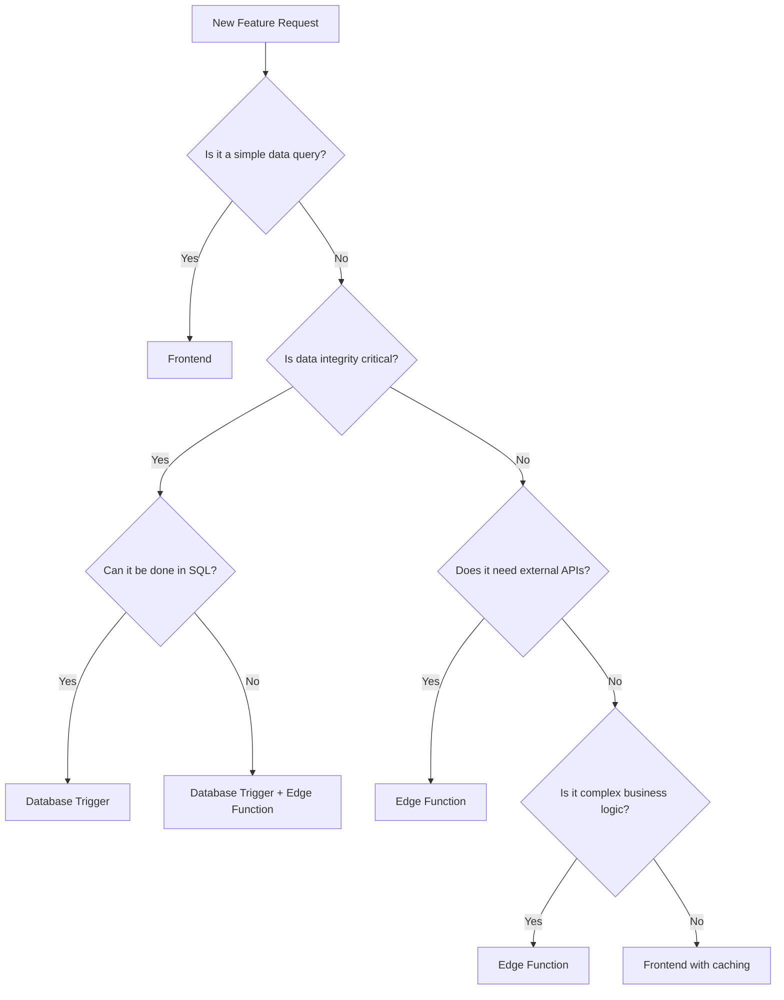

# 🎯 Decision Matrix

## When to Use Each Approach

This guide helps you decide whether to implement functionality in **Frontend**, **Database Triggers**, or **Edge Functions**.

## 🚦 Decision Tree



## 📊 Comparison Matrix

| Criteria | Frontend | Database Triggers | Edge Functions |
|----------|----------|-------------------|----------------|
| **Response Time** | 🟢 50-100ms | 🟢 <1ms | 🟡 200-2000ms |
| **Data Integrity** | 🟡 Can be bypassed | 🟢 Guaranteed | 🟡 Depends on implementation |
| **External APIs** | 🔴 Limited/None | 🔴 None | 🟢 Full support |
| **Complex Logic** | 🟡 Limited by device | 🟡 SQL only | 🟢 Full programming |
| **Real-time Updates** | 🟢 Excellent | 🟢 Instant | 🔴 Not real-time |
| **Error Handling** | 🟢 Easy to handle | 🟡 Limited options | 🟢 Full control |
| **Testing** | 🟢 Easy | 🔴 Difficult | 🟡 Moderate |
| **Debugging** | 🟢 Easy | 🔴 Complex | 🟡 Moderate |
| **Scalability** | 🟡 Device limited | 🟢 Database scales | 🟢 Auto-scaling |
| **Development Speed** | 🟢 Fast | 🟡 SQL knowledge needed | 🟡 Setup overhead |
| **Maintenance** | 🟢 Easy updates | 🔴 Schema changes needed | 🟡 Deployment required |

## 🎯 Use Case Examples

### ✅ Frontend (React Native + Supabase)

#### **Simple Queries**
```typescript
// ✅ Perfect for frontend
const getAppointments = async (userId: string) => {
  return supabase
    .from('appointments')
    .select('*, doctors(*)')
    .eq('patient_id', userId)
    .order('appointment_date')
}
```
**Why Frontend:** Fast, simple, no business logic

#### **Real-time Data**
```typescript
// ✅ Perfect for frontend
const useRealTimeAppointments = (userId: string) => {
  useEffect(() => {
    const channel = supabase
      .channel('appointments')
      .on('postgres_changes', { 
        event: '*', 
        schema: 'public', 
        table: 'appointments' 
      }, handleUpdate)
      .subscribe()
  }, [])
}
```
**Why Frontend:** Real-time subscriptions, instant UI updates

#### **User Interface Logic**
```typescript
// ✅ Perfect for frontend
const [selectedDate, setSelectedDate] = useState(new Date())
const [availableSlots, setAvailableSlots] = useState([])

const handleDateChange = async (date: Date) => {
  setSelectedDate(date)
  const slots = await getAvailableSlots(doctorId, date)
  setAvailableSlots(slots)
}
```
**Why Frontend:** UI state management, user interactions

---

### ✅ Database Triggers (PostgreSQL Functions)

#### **Data Validation**
```sql
-- ✅ Perfect for database trigger
CREATE OR REPLACE FUNCTION validate_appointment()
RETURNS TRIGGER AS $$
BEGIN
  IF NEW.appointment_date < CURRENT_DATE THEN
    RAISE EXCEPTION 'Cannot book appointment in the past';
  END IF;
  RETURN NEW;
END;
$$ LANGUAGE plpgsql;
```
**Why Database Trigger:** Must never be bypassed, data integrity critical

#### **Automatic Updates**
```sql
-- ✅ Perfect for database trigger
CREATE OR REPLACE FUNCTION update_doctor_stats()
RETURNS TRIGGER AS $$
BEGIN
  UPDATE doctors 
  SET total_appointments = total_appointments + 1
  WHERE id = NEW.doctor_id;
  RETURN NEW;
END;
$$ LANGUAGE plpgsql;
```
**Why Database Trigger:** Automatic, atomic, can't be forgotten

#### **Prevent Data Conflicts**
```sql
-- ✅ Perfect for database trigger
CREATE OR REPLACE FUNCTION prevent_double_booking()
RETURNS TRIGGER AS $$
BEGIN
  IF EXISTS (
    SELECT 1 FROM appointments 
    WHERE doctor_id = NEW.doctor_id 
    AND appointment_date = NEW.appointment_date 
    AND time_slot = NEW.time_slot
  ) THEN
    RAISE EXCEPTION 'Time slot already booked';
  END IF;
  RETURN NEW;
END;
$$ LANGUAGE plpgsql;
```
**Why Database Trigger:** Race condition prevention, guaranteed consistency

---

### ✅ Edge Functions (Deno/TypeScript)

#### **External Integrations**
```typescript
// ✅ Perfect for edge function
export default async function sendNotifications(req: Request) {
  const { appointmentId } = await req.json()
  
  await Promise.all([
    sendSMS(patient.phone, message),      // Twilio API
    sendEmail(patient.email, template),   // SendGrid API
    createCalendarEvent(appointment),     // Google Calendar API
    sendPushNotification(patient.id)      // Firebase API
  ])
}
```
**Why Edge Function:** External APIs, complex integrations, secrets management

#### **Payment Processing**
```typescript
// ✅ Perfect for edge function
export default async function processPayment(req: Request) {
  const { appointmentId, paymentMethodId } = await req.json()
  
  // Stripe payment processing
  const paymentIntent = await stripe.paymentIntents.create({
    amount: appointment.fee * 100,
    currency: 'usd',
    payment_method: paymentMethodId
  })
  
  // Update appointment status
  await supabase
    .from('appointments')
    .update({ payment_status: 'paid' })
    .eq('id', appointmentId)
}
```
**Why Edge Function:** Secure payment processing, API keys, complex workflow

#### **Heavy Data Processing**
```typescript
// ✅ Perfect for edge function
export default async function generateReport(req: Request) {
  const { doctorId, period } = await req.json()
  
  // Complex calculations
  const appointments = await getAppointmentHistory(doctorId, period)
  const analytics = await calculateDoctorMetrics(appointments)
  const pdf = await generatePDFReport(analytics)
  const url = await uploadToCloudStorage(pdf)
  
  return { reportUrl: url }
}
```
**Why Edge Function:** Heavy processing, file generation, cloud storage

---

## 🔀 Hybrid Approaches

### Database Trigger + Edge Function

```sql
-- Database trigger ensures data integrity
CREATE OR REPLACE FUNCTION appointment_workflow()
RETURNS TRIGGER AS $$
BEGIN
  -- Critical validation (in trigger)
  IF NOT slot_is_available(NEW.doctor_id, NEW.appointment_date, NEW.time_slot) THEN
    RAISE EXCEPTION 'Slot not available';
  END IF;
  
  -- Mark slot as booked (in trigger)
  UPDATE doctor_availability 
  SET is_available = false 
  WHERE doctor_id = NEW.doctor_id AND date = NEW.appointment_date;
  
  -- Call edge function for external operations (async)
  PERFORM net.http_post(
    'https://your-project.supabase.co/functions/v1/appointment-workflow',
    jsonb_build_object('appointmentId', NEW.id)
  );
  
  RETURN NEW;
END;
$$ LANGUAGE plpgsql;
```

**Why Hybrid:** Data integrity guaranteed by trigger, external operations by edge function

### Frontend + Edge Function Fallback

```typescript
// Frontend with edge function fallback
const bookAppointment = async (data: AppointmentData) => {
  try {
    // Option 1: Complex workflow with immediate confirmation
    return await appointmentService.createAppointmentWithConfirmation(data)
  } catch (error) {
    // Option 2: Simple creation (triggers handle validation)
    return await appointmentService.createAppointment(data)
  }
}
```

**Why Hybrid:** Best user experience with reliable fallback

## 📋 Decision Checklist

### Choose **Frontend** when:
- [ ] Simple SELECT queries
- [ ] Real-time data needed
- [ ] UI state management
- [ ] User interactions
- [ ] Response time < 100ms required
- [ ] No external dependencies
- [ ] Easy testing required

### Choose **Database Triggers** when:
- [ ] Data integrity is critical
- [ ] Business rules must be enforced
- [ ] Automatic operations needed
- [ ] Cannot be bypassed by any client
- [ ] Atomic transactions required
- [ ] SQL operations are sufficient
- [ ] Performance is critical

### Choose **Edge Functions** when:
- [ ] External API integration needed
- [ ] Complex business logic required
- [ ] Payment processing involved
- [ ] File processing/generation needed
- [ ] Scheduled tasks required
- [ ] Third-party service integration
- [ ] Server-side secrets needed

## 🚀 Implementation Strategy

### 1. Start Simple (Frontend)
```typescript
// Start with frontend implementation
const result = await supabase
  .from('appointments')
  .insert(appointmentData)
```

### 2. Add Data Integrity (Database Triggers)
```sql
-- Add validation and business rules
CREATE TRIGGER validate_appointment_trigger
    BEFORE INSERT ON appointments
    FOR EACH ROW EXECUTE FUNCTION validate_appointment();
```

### 3. Enhance with External Operations (Edge Functions)
```typescript
// Add complex workflows
export default async function enhancedBooking(req: Request) {
  // Create appointment + send notifications + process payment
}
```

### 4. Optimize and Monitor
```typescript
// Add caching, error handling, monitoring
const cachedResult = await getCachedData(key) || await fetchData()
```

## 📊 Performance Guidelines

| Operation Type | Target Response Time | Recommended Approach |
|----------------|---------------------|---------------------|
| Simple query | < 100ms | Frontend |
| Data validation | < 1ms | Database Trigger |
| Complex workflow | < 2000ms | Edge Function |
| Real-time update | Instant | Frontend Subscription |
| External API call | < 5000ms | Edge Function |
| File processing | < 30000ms | Edge Function |

## 🎯 Anti-Patterns to Avoid

### ❌ Wrong: Complex Logic in Frontend
```typescript
// Don't do heavy processing in React Native
const generateReport = async () => {
  const data = await fetchLargeDataset()
  const processed = await heavyCalculations(data) // Blocks UI
  const pdf = await generatePDF(processed) // Out of memory
}
```

### ❌ Wrong: External APIs in Database Triggers
```sql
-- Don't call external APIs from triggers
CREATE OR REPLACE FUNCTION send_sms_trigger()
RETURNS TRIGGER AS $$
BEGIN
  -- This will fail and block the database
  PERFORM net.http_post('https://api.twilio.com/...'); 
  RETURN NEW;
END;
$$ LANGUAGE plpgsql;
```

### ❌ Wrong: Simple Queries in Edge Functions
```typescript
// Don't use edge functions for simple queries
export default async function getAppointments(req: Request) {
  // Unnecessary overhead for simple query
  const { data } = await supabase.from('appointments').select('*')
  return new Response(JSON.stringify(data))
}
```

---

**Next:** [Performance Comparison](./06-performance-comparison.md)
