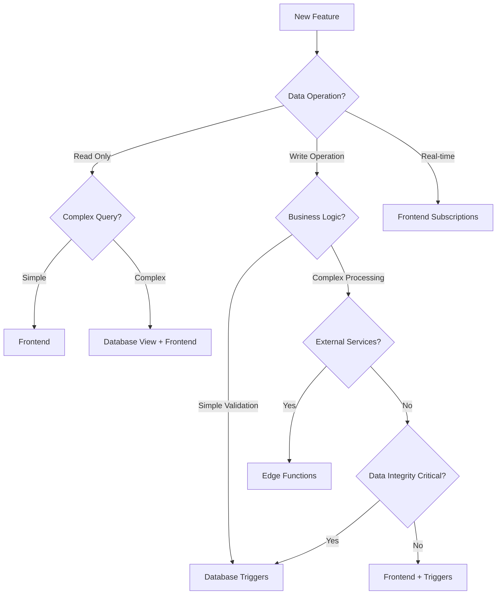

# ❓ FAQ and Troubleshooting

## Overview

This document addresses common questions and troubleshooting scenarios when working with the hybrid architecture of **Frontend**, **Database Triggers**, and **Edge Functions**.

## 🤔 Frequently Asked Questions

### General Architecture Questions

#### Q: When should I use Frontend vs Database Triggers vs Edge Functions?

**A:** Follow this decision tree:



**Quick Reference:**
- **Frontend**: User interactions, simple queries, real-time UI updates
- **Database Triggers**: Data validation, integrity constraints, audit logging
- **Edge Functions**: External API calls, complex business logic, notifications

#### Q: Can Edge Functions replace Database Triggers entirely?

**A:** No, they serve different purposes:

```typescript
// ❌ BAD: Using Edge Function for data integrity
export default async function validateAppointment(req: Request) {
  const { appointment } = await req.json()
  
  // This creates a race condition!
  const existing = await supabase
    .from('appointments')
    .select('id')
    .eq('doctor_id', appointment.doctorId)
    .eq('appointment_date', appointment.date)
  
  if (existing.data?.length > 0) {
    return new Response('Conflict', { status: 409 })
  }
  
  // Another request could create a conflict here!
  await supabase.from('appointments').insert(appointment)
}

// ✅ GOOD: Using Database Trigger for data integrity
-- This is atomic and prevents race conditions
CREATE OR REPLACE FUNCTION prevent_double_booking()
RETURNS TRIGGER AS $$
BEGIN
    IF EXISTS (
        SELECT 1 FROM appointments 
        WHERE doctor_id = NEW.doctor_id 
        AND appointment_date = NEW.appointment_date
        AND status != 'cancelled'
    ) THEN
        RAISE EXCEPTION 'Time slot already booked';
    END IF;
    RETURN NEW;
END;
$$ LANGUAGE plpgsql;
```

#### Q: How do I handle complex business logic that spans multiple tables?

**A:** Use a combination approach:

```typescript
// ✅ GOOD: Hybrid approach
export default async function complexBookingWorkflow(req: Request) {
  const { appointmentData } = await req.json()
  
  // 1. Database triggers handle data integrity automatically
  // 2. Edge function handles complex business logic
  const result = await supabase.rpc('create_appointment_with_workflow', {
    appointment_data: appointmentData,
    workflow_config: {
      send_notifications: true,
      block_calendar: true,
      charge_payment: appointmentData.requiresPayment
    }
  })
  
  // 3. Handle external services in parallel
  await Promise.allSettled([
    sendConfirmationEmail(result.data),
    updateExternalCalendar(result.data),
    processPayment(result.data)
  ])
  
  return new Response(JSON.stringify(result.data))
}
```

### Performance Questions

#### Q: Why is my Edge Function slow on first call?

**A:** Cold start penalty. Here's how to minimize it:

```typescript
// ✅ GOOD: Optimize for cold starts
import { createClient } from 'https://esm.sh/@supabase/supabase-js@2'

// Initialize connections outside the handler
const supabase = createClient(
  Deno.env.get('SUPABASE_URL')!,
  Deno.env.get('SUPABASE_SERVICE_ROLE_KEY')!,
  {
    auth: { persistSession: false }, // Faster initialization
    db: { schema: 'public' }
  }
)

// Pre-warm frequently used data
let doctorCache: Map<string, any> | null = null

export default async function(req: Request) {
  // Lazy load cache on first request
  if (!doctorCache) {
    const { data } = await supabase.from('doctors').select('id, name, email')
    doctorCache = new Map(data?.map(d => [d.id, d]) || [])
  }
  
  // Use cached data instead of database query
  const doctor = doctorCache.get(doctorId)
  // ... rest of function
}

// ❌ BAD: Creating new connections and queries every time
export default async function(req: Request) {
  // This creates new connection every time (slow)
  const supabase = createClient(url, key)
  
  // This queries database every time (unnecessary)
  const { data: doctor } = await supabase
    .from('doctors')
    .select('*')
    .eq('id', doctorId)
    .single()
}
```

#### Q: How can I make my frontend queries faster?

**A:** Use these optimization strategies:

```typescript
// ✅ GOOD: Optimized query patterns
const optimizedPatterns = {
  // 1. Select only needed fields
  basicQuery: supabase
    .from('appointments')
    .select('id, appointment_date, status')
    .eq('patient_id', userId),

  // 2. Use pagination
  paginatedQuery: supabase
    .from('appointments')
    .select('*')
    .range(0, 19) // 20 items per page
    .order('appointment_date'),

  // 3. Use indexes effectively
  indexedQuery: supabase
    .from('appointments')
    .select('*')
    .eq('patient_id', userId) // Assuming index on patient_id
    .gte('appointment_date', startDate) // Use range queries
    .lt('appointment_date', endDate),

  // 4. Combine related data in one query
  joinQuery: supabase
    .from('appointments')
    .select(`
      id, appointment_date, status,
      doctor:doctors(name, specialization),
      clinic:clinics(name, address)
    `)
    .eq('patient_id', userId)
}

// ✅ GOOD: Caching with React Query
export function useOptimizedAppointments(patientId: string) {
  return useQuery({
    queryKey: ['appointments', patientId],
    queryFn: () => optimizedPatterns.joinQuery,
    staleTime: 5 * 60 * 1000, // Consider data fresh for 5 minutes
    cacheTime: 10 * 60 * 1000, // Keep in cache for 10 minutes
    refetchOnWindowFocus: false // Don't refetch on every focus
  })
}
```

### Real-time and Synchronization

#### Q: How do I handle real-time updates when users are offline?

**A:** Implement offline-first patterns:

```typescript
// ✅ GOOD: Offline-first approach
export function useOfflineAppointments(patientId: string) {
  const [isOnline, setIsOnline] = useState(navigator.onLine)
  const queryClient = useQueryClient()

  // Monitor network status
  useEffect(() => {
    const handleOnline = () => setIsOnline(true)
    const handleOffline = () => setIsOnline(false)

    window.addEventListener('online', handleOnline)
    window.addEventListener('offline', handleOffline)

    return () => {
      window.removeEventListener('online', handleOnline)
      window.removeEventListener('offline', handleOffline)
    }
  }, [])

  const appointmentsQuery = useQuery({
    queryKey: ['appointments', patientId],
    queryFn: async () => {
      const { data, error } = await supabase
        .from('appointments')
        .select('*')
        .eq('patient_id', patientId)
      
      if (error) throw error
      
      // Store in local storage for offline access
      localStorage.setItem(`appointments_${patientId}`, JSON.stringify(data))
      return data
    },
    enabled: isOnline, // Only query when online
    retry: false // Don't retry when offline
  })

  // Load from cache when offline
  const offlineData = useMemo(() => {
    if (!isOnline && !appointmentsQuery.data) {
      const cached = localStorage.getItem(`appointments_${patientId}`)
      return cached ? JSON.parse(cached) : []
    }
    return appointmentsQuery.data || []
  }, [isOnline, appointmentsQuery.data, patientId])

  // Sync when coming back online
  useEffect(() => {
    if (isOnline) {
      queryClient.invalidateQueries(['appointments', patientId])
    }
  }, [isOnline, queryClient, patientId])

  return {
    data: offlineData,
    isOnline,
    isLoading: appointmentsQuery.isLoading,
    error: appointmentsQuery.error
  }
}
```

#### Q: What happens if multiple users try to book the same appointment slot?

**A:** Database triggers prevent this automatically:

```sql
-- Database handles concurrency automatically
CREATE OR REPLACE FUNCTION prevent_double_booking()
RETURNS TRIGGER AS $$
BEGIN
    -- This check is atomic and handles race conditions
    IF EXISTS (
        SELECT 1 FROM appointments 
        WHERE doctor_id = NEW.doctor_id 
        AND appointment_date = NEW.appointment_date 
        AND status NOT IN ('cancelled', 'completed')
        FOR UPDATE -- Lock to prevent race conditions
    ) THEN
        RAISE EXCEPTION 'Time slot already booked';
    END IF;
    
    RETURN NEW;
END;
$$ LANGUAGE plpgsql;
```

Frontend handles the error gracefully:

```typescript
// Frontend handles booking conflicts
export function useBookAppointment() {
  return useMutation({
    mutationFn: async (appointmentData) => {
      const { data, error } = await supabase
        .from('appointments')
        .insert(appointmentData)
      
      if (error) throw error
      return data
    },
    onError: (error) => {
      if (error.message.includes('already booked')) {
        Alert.alert(
          'Slot Unavailable',
          'This time slot was just booked by another patient. Please select a different time.'
        )
      } else {
        Alert.alert('Error', 'Failed to book appointment. Please try again.')
      }
    }
  })
}
```

## 🔧 Common Troubleshooting Scenarios

### Database Issues

#### Problem: Trigger not firing

**Symptoms:**
```sql
-- Trigger exists but doesn't execute
\dT appointments
-- Shows trigger but no effect on INSERT/UPDATE
```

**Solution:**
```sql
-- Check if trigger is enabled
SELECT tgname, tgenabled, tgrelid::regclass 
FROM pg_trigger 
WHERE tgrelid = 'appointments'::regclass;

-- Re-enable if disabled
ALTER TABLE appointments ENABLE TRIGGER appointment_workflow_trigger;

-- Check for errors in function
DO $$
BEGIN
    PERFORM appointment_workflow_trigger();
EXCEPTION WHEN OTHERS THEN
    RAISE NOTICE 'Error: %', SQLERRM;
END $$;

-- Test trigger manually
INSERT INTO appointments (doctor_id, patient_id, appointment_date) 
VALUES ('test-doctor', 'test-patient', NOW() + INTERVAL '1 day');
```

#### Problem: Slow database queries

**Symptoms:**
```
Query takes >500ms
Frontend shows loading state for too long
```

**Diagnosis:**
```sql
-- Check query performance
EXPLAIN (ANALYZE, BUFFERS) 
SELECT * FROM appointments 
WHERE patient_id = 'user-123' 
AND appointment_date >= CURRENT_DATE;

-- Check for missing indexes
SELECT schemaname, tablename, attname, n_distinct, correlation 
FROM pg_stats 
WHERE tablename = 'appointments';
```

**Solution:**
```sql
-- Add appropriate indexes
CREATE INDEX CONCURRENTLY idx_appointments_patient_date 
ON appointments(patient_id, appointment_date);

-- Update table statistics
ANALYZE appointments;

-- Consider partitioning for large tables
CREATE TABLE appointments_2024 PARTITION OF appointments
FOR VALUES FROM ('2024-01-01') TO ('2025-01-01');
```

### Edge Function Issues

#### Problem: Edge Function timeouts

**Symptoms:**
```
Error: Function timeout after 30 seconds
Network request failed
```

**Diagnosis:**
```typescript
// Add timing logs to identify bottlenecks
export default async function(req: Request) {
  const startTime = Date.now()
  console.log('Function started')

  try {
    console.log(`Step 1 completed in ${Date.now() - startTime}ms`)
    const data = await parseRequest(req)
    
    console.log(`Step 2 completed in ${Date.now() - startTime}ms`)
    const result = await processData(data)
    
    console.log(`Step 3 completed in ${Date.now() - startTime}ms`)
    await sendNotifications(result)
    
    console.log(`Function completed in ${Date.now() - startTime}ms`)
    return new Response(JSON.stringify(result))
    
  } catch (error) {
    console.error(`Function failed after ${Date.now() - startTime}ms`, error)
    throw error
  }
}
```

**Solution:**
```typescript
// Optimize slow operations
export default async function optimizedFunction(req: Request) {
  const data = await req.json()
  
  // 1. Process in parallel where possible
  const [doctor, patient, availability] = await Promise.all([
    getDoctor(data.doctorId),
    getPatient(data.patientId),
    checkAvailability(data.doctorId, data.date)
  ])
  
  // 2. Use connection pooling
  const supabase = getPooledConnection()
  
  // 3. Batch database operations
  const { data: result } = await supabase
    .from('appointments')
    .insert(data)
    .select('*')
    .single()
  
  // 4. Fire and forget for non-critical operations
  void sendNotifications(result) // Don't wait for this
  
  return new Response(JSON.stringify(result))
}

function getPooledConnection() {
  // Reuse connections instead of creating new ones
  if (!globalThis.supabaseClient) {
    globalThis.supabaseClient = createClient(url, key, {
      db: { schema: 'public' },
      auth: { persistSession: false }
    })
  }
  return globalThis.supabaseClient
}
```

#### Problem: Edge Function not receiving trigger calls

**Symptoms:**
```
Database trigger fires but edge function not called
HTTP 500 errors in trigger logs
```

**Diagnosis:**
```sql
-- Check if HTTP extension is enabled
SELECT * FROM pg_extension WHERE extname = 'http';

-- Test HTTP call manually
SELECT net.http_post(
    url := 'https://your-project.supabase.co/functions/v1/test',
    headers := '{"Authorization": "Bearer your-anon-key"}',
    body := '{"test": true}'
);
```

**Solution:**
```sql
-- Enable HTTP extension if not available
CREATE EXTENSION IF NOT EXISTS http;

-- Fix trigger function
CREATE OR REPLACE FUNCTION safe_http_trigger()
RETURNS TRIGGER AS $$
BEGIN
    BEGIN
        PERFORM net.http_post(
            url := current_setting('app.edge_function_url'),
            headers := jsonb_build_object(
                'Authorization', 'Bearer ' || current_setting('app.service_role_key'),
                'Content-Type', 'application/json'
            ),
            body := row_to_json(NEW)::text
        );
    EXCEPTION WHEN OTHERS THEN
        -- Log error but don't fail the transaction
        INSERT INTO error_logs (error_message, context) 
        VALUES (SQLERRM, 'HTTP trigger call failed');
    END;
    
    RETURN NEW;
END;
$$ LANGUAGE plpgsql;
```

### Frontend Issues

#### Problem: Real-time subscriptions not working

**Symptoms:**
```
UI doesn't update when data changes
No real-time events received
```

**Diagnosis:**
```typescript
// Debug subscription setup
useEffect(() => {
  console.log('Setting up subscription for patient:', patientId)
  
  const subscription = supabase
    .channel('debug-appointments')
    .on('postgres_changes', {
      event: '*',
      schema: 'public',
      table: 'appointments',
      filter: `patient_id=eq.${patientId}`
    }, (payload) => {
      console.log('Received real-time update:', payload)
      // Update logic here
    })
    .subscribe((status) => {
      console.log('Subscription status:', status)
    })

  return () => {
    console.log('Cleaning up subscription')
    subscription.unsubscribe()
  }
}, [patientId])
```

**Solution:**
```typescript
// Fix common subscription issues
export function useRealtimeAppointments(patientId: string) {
  const queryClient = useQueryClient()
  
  useEffect(() => {
    if (!patientId) return // Don't subscribe without patient ID
    
    const subscription = supabase
      .channel(`appointments:${patientId}`) // Unique channel name
      .on('postgres_changes', {
        event: '*',
        schema: 'public',
        table: 'appointments',
        filter: `patient_id=eq.${patientId}`
      }, (payload) => {
        // Update React Query cache
        queryClient.setQueryData(['appointments', patientId], (old: any) => {
          if (!old) return old
          
          switch (payload.eventType) {
            case 'INSERT':
              return [...old, payload.new]
            case 'UPDATE':
              return old.map((item: any) => 
                item.id === payload.new.id ? payload.new : item
              )
            case 'DELETE':
              return old.filter((item: any) => item.id !== payload.old.id)
            default:
              return old
          }
        })
      })
      .subscribe()

    return () => {
      subscription.unsubscribe()
    }
  }, [patientId, queryClient])
}
```

#### Problem: Optimistic updates not reverting on error

**Symptoms:**
```
UI shows successful state even when operation failed
Stale data displayed to user
```

**Solution:**
```typescript
// Proper optimistic update with rollback
export function useCancelAppointment() {
  const queryClient = useQueryClient()

  return useMutation({
    mutationFn: async (appointmentId: string) => {
      const { error } = await supabase
        .from('appointments')
        .update({ status: 'cancelled' })
        .eq('id', appointmentId)
      
      if (error) throw error
    },
    onMutate: async (appointmentId) => {
      // Cancel any outgoing refetches
      await queryClient.cancelQueries(['appointments'])

      // Snapshot the previous value
      const previousAppointments = queryClient.getQueryData(['appointments'])

      // Optimistically update
      queryClient.setQueryData(['appointments'], (old: any) =>
        old?.map((apt: any) => 
          apt.id === appointmentId 
            ? { ...apt, status: 'cancelled' }
            : apt
        )
      )

      // Return context with snapshot
      return { previousAppointments }
    },
    onError: (err, appointmentId, context) => {
      // Rollback to previous state
      if (context?.previousAppointments) {
        queryClient.setQueryData(['appointments'], context.previousAppointments)
      }
    },
    onSettled: () => {
      // Always refetch after error or success
      queryClient.invalidateQueries(['appointments'])
    }
  })
}
```

## 🚨 Error Handling Patterns

### Database Error Handling

```sql
-- Comprehensive error handling in triggers
CREATE OR REPLACE FUNCTION robust_appointment_trigger()
RETURNS TRIGGER AS $$
DECLARE
    error_context TEXT;
BEGIN
    BEGIN
        -- Your business logic here
        PERFORM validate_appointment(NEW);
        PERFORM update_availability(NEW);
        
    EXCEPTION
        WHEN check_violation THEN
            error_context := 'Business rule violation: ' || SQLERRM;
            INSERT INTO error_logs (error_type, error_message, table_name, record_id)
            VALUES ('CHECK_VIOLATION', error_context, TG_TABLE_NAME, NEW.id);
            RAISE EXCEPTION '%', error_context;
            
        WHEN unique_violation THEN
            error_context := 'Duplicate appointment detected';
            INSERT INTO error_logs (error_type, error_message, table_name, record_id)
            VALUES ('UNIQUE_VIOLATION', error_context, TG_TABLE_NAME, NEW.id);
            RAISE EXCEPTION '%', error_context;
            
        WHEN foreign_key_violation THEN
            error_context := 'Invalid doctor or patient reference';
            INSERT INTO error_logs (error_type, error_message, table_name, record_id)
            VALUES ('FK_VIOLATION', error_context, TG_TABLE_NAME, NEW.id);
            RAISE EXCEPTION '%', error_context;
            
        WHEN OTHERS THEN
            error_context := 'Unexpected error: ' || SQLERRM;
            INSERT INTO error_logs (error_type, error_message, table_name, record_id, error_detail)
            VALUES ('UNKNOWN', error_context, TG_TABLE_NAME, NEW.id, SQLSTATE);
            RAISE EXCEPTION 'System error occurred. Please contact support.';
    END;
    
    RETURN NEW;
END;
$$ LANGUAGE plpgsql;
```

### Edge Function Error Handling

```typescript
// Comprehensive error handling in edge functions
export default async function(req: Request) {
  const requestId = crypto.randomUUID()
  
  try {
    const data = await req.json()
    
    // Validate input
    if (!data.appointmentId) {
      return errorResponse(400, 'Missing appointment ID', requestId)
    }
    
    const result = await processAppointment(data)
    return successResponse(result, requestId)
    
  } catch (error) {
    return handleError(error, requestId)
  }
}

function handleError(error: Error, requestId: string): Response {
  console.error(`[${requestId}] Error:`, error)
  
  // Database connection errors
  if (error.message.includes('connection')) {
    return errorResponse(503, 'Database temporarily unavailable', requestId)
  }
  
  // Business rule violations
  if (error.message.includes('BUSINESS_RULE')) {
    return errorResponse(422, error.message.replace('BUSINESS_RULE: ', ''), requestId)
  }
  
  // External service errors
  if (error.message.includes('SMS') || error.message.includes('EMAIL')) {
    // Log but don't fail the whole operation
    console.warn(`[${requestId}] External service failed:`, error.message)
    return successResponse({ 
      warning: 'Operation completed but notifications may be delayed' 
    }, requestId)
  }
  
  // Default error
  return errorResponse(500, 'Internal server error', requestId)
}

function errorResponse(status: number, message: string, requestId: string): Response {
  return new Response(JSON.stringify({
    error: message,
    requestId,
    timestamp: new Date().toISOString()
  }), {
    status,
    headers: { 'Content-Type': 'application/json' }
  })
}
```

### Frontend Error Handling

```typescript
// Comprehensive frontend error handling
export function useAppointmentOperations() {
  const [error, setError] = useState<string | null>(null)
  
  const handleError = useCallback((error: any) => {
    console.error('Operation failed:', error)
    
    // Clear previous error
    setError(null)
    
    // Handle specific error types
    if (error.message?.includes('not available')) {
      setError('This time slot is no longer available. Please select a different time.')
      return
    }
    
    if (error.message?.includes('unauthorized')) {
      setError('You are not authorized to perform this action.')
      return
    }
    
    if (error.message?.includes('network')) {
      setError('Please check your internet connection and try again.')
      return
    }
    
    // Default error message
    setError('An unexpected error occurred. Please try again.')
  }, [])
  
  const bookAppointment = useMutation({
    mutationFn: appointmentService.book,
    onError: handleError,
    onSuccess: () => setError(null)
  })
  
  return {
    bookAppointment: bookAppointment.mutate,
    isLoading: bookAppointment.isPending,
    error
  }
}
```

## 📞 Getting Help

### Debug Information to Collect

When reporting issues, include:

1. **Environment Details:**
```bash
# Database version
SELECT version();

# Supabase CLI version
supabase --version

# Node/Deno version
node --version
deno --version
```

2. **Error Logs:**
```sql
-- Database errors
SELECT * FROM error_logs 
WHERE created_at > NOW() - INTERVAL '1 hour'
ORDER BY created_at DESC;

-- Trigger status
SELECT tgname, tgenabled FROM pg_trigger 
WHERE tgrelid = 'appointments'::regclass;
```

3. **Function Logs:**
```typescript
// Add to edge functions
console.log('Function version: 1.0.0')
console.log('Environment:', Deno.env.get('ENVIRONMENT'))
console.log('Request details:', {
  method: req.method,
  url: req.url,
  headers: Object.fromEntries(req.headers.entries())
})
```

### Performance Debugging

```sql
-- Check slow queries
SELECT query, mean_time, calls, total_time 
FROM pg_stat_statements 
WHERE query LIKE '%appointments%'
ORDER BY total_time DESC 
LIMIT 10;

-- Check index usage
SELECT schemaname, tablename, indexname, idx_scan, idx_tup_read, idx_tup_fetch
FROM pg_stat_user_indexes 
WHERE tablename = 'appointments';
```

---

**Congratulations!** 🎉 You now have comprehensive documentation for implementing a hybrid architecture with React Native, Supabase, and Edge Functions. This documentation covers everything from basic concepts to advanced troubleshooting scenarios.
